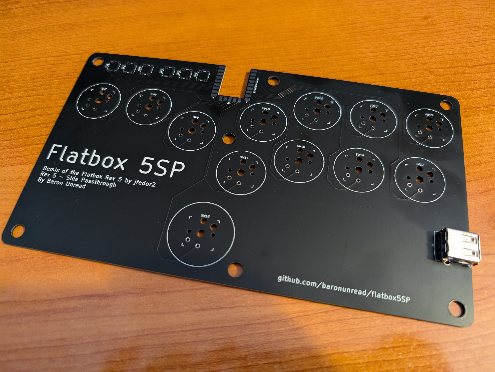

# Flatbox rev 5SP

This is rev 5SP, remix of [Jfedor2's Rev 5](https://github.com/jfedor2/flatbox/tree/master/hardware-rev5). In this version an [RP2040-Zero](https://www.waveshare.com/rp2040-zero.htm) board is soldered onto the main PCB and a USB female port is added to the side.

To make one you will need:

* [3D printed](3d-printed-case) case parts - top and bottom
* [the Flatbox 5SP PCB](pcb)
* [RP2040-Zero](https://www.waveshare.com/rp2040-zero.htm)
* 1 USB Female port, I got one from [Aliexpress](https://aliexpress.com/item/32265708803.html)
* 12x Kailh low profile (choc v1) switches of your choice
* (optionally) 12x Kailh low profile hotswap sockets
* [3D printed buttoncaps](../3d-printed-buttoncaps)
* 6x tact switches: 6x6x5mm for the 3D printed case and 6x6x7mm or 6x6x8mm for the CNC machined case
* 7x M3x6 flat head screws
* some kind of rubber feet or non-slip padding for the bottom
* a soldering iron

I printed the case at 0.20mm layer height. The top part should be printed upside-down, the bottom part should be printed as-is. They don't require supports.

The PCB can be ordered from a number of online services using the included [Gerber files](pcb), I used [JLCPCB](https://jlcpcb.com/) (leave all the settings at default, you can choose the PCB color). PCB thickness should be 1.6mm.

The switches can be soldered in directly to the PCB or you can use hotswap sockets. There's only one version of the case and it supports the added size of the hotswap sockets.

For the firmware you probably want to use [GP2040-CE](https://gp2040-ce.info/). Go to the [GP2040-CE downloads page](https://gp2040-ce.info/downloads/) and get the UF2 file for Flatbox rev5. Do not get the file for the Waveshare RP2040-Zero, even though your stick uses it (it has a different pinout).

To flash the firmware, connect the board to a computer with a USB cable, then press the RESET button while holding the BOOT button on the RP2040-Zero. A drive named "RPI-RP2" should appear. Copy the UF2 file you downloaded to that drive. That's it.

(Of course you can also use any other RP2040-compatible firmware if you want.)

PCB design licensed under [CC BY-SA 4.0](https://creativecommons.org/licenses/by-sa/4.0/).

PCB design uses the following:

* [keyswitches.pretty](https://github.com/daprice/keyswitches.pretty) by [daprice](https://github.com/daprice) ([CC BY-SA 4.0](https://creativecommons.org/licenses/by-sa/4.0/))
* RP2040-Zero STEP file downloaded from [Waveshare wiki](https://www.waveshare.com/wiki/RP2040-Zero)
